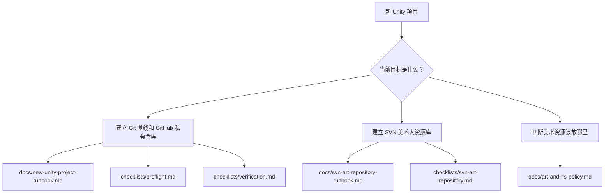

# Knowledge Index

这个索引帮助 AI 在新项目中快速选择正确方法。先判断任务类型，再进入对应文档。

## 执行路线图

## 分类导航

| 分类 | 文件 | 用途 |
| --- | --- | --- |
| AI 总规则 | `AGENTS.md` | 新项目开始前给 AI 的总约束 |
| Git 基线 | `docs/new-unity-project-runbook.md` | 建立 Git、GitHub、基线标签、目录重构 |
| SVN 美术库 | `docs/svn-art-repository-runbook.md` | 本机 SVN 仓库、工作副本、锁定规则、备份 |
| 美术策略 | `docs/art-and-lfs-policy.md` | 判断 Git、Git LFS、SVN、本地资产库的边界 |
| 环境搭建 | `docs/environment-setup.md` | GitHub CLI、代理、SVN 工具、路径习惯 |
| 案例复盘 | `docs/tf2d-case-study.md` | TF_2D 真实执行记录 |
| 检查清单 | `checklists/` | 执行前后逐项核对 |
| 模板 | `templates/` | 可复制进新项目的基础文件 |
| 提示词 | `prompts/` | 直接交给 AI 的任务提示 |

## 推荐顺序

如果是完整新项目，建议按这个顺序：

1. `AGENTS.md`
2. `docs/new-unity-project-runbook.md`
3. `checklists/preflight.md`
4. `templates/unity.gitignore`
5. `templates/unity.gitattributes`
6. `docs/svn-art-repository-runbook.md`
7. `checklists/svn-art-repository.md`
8. `checklists/verification.md`

如果只是补 SVN 美术资源库，从第 6 步开始即可。
