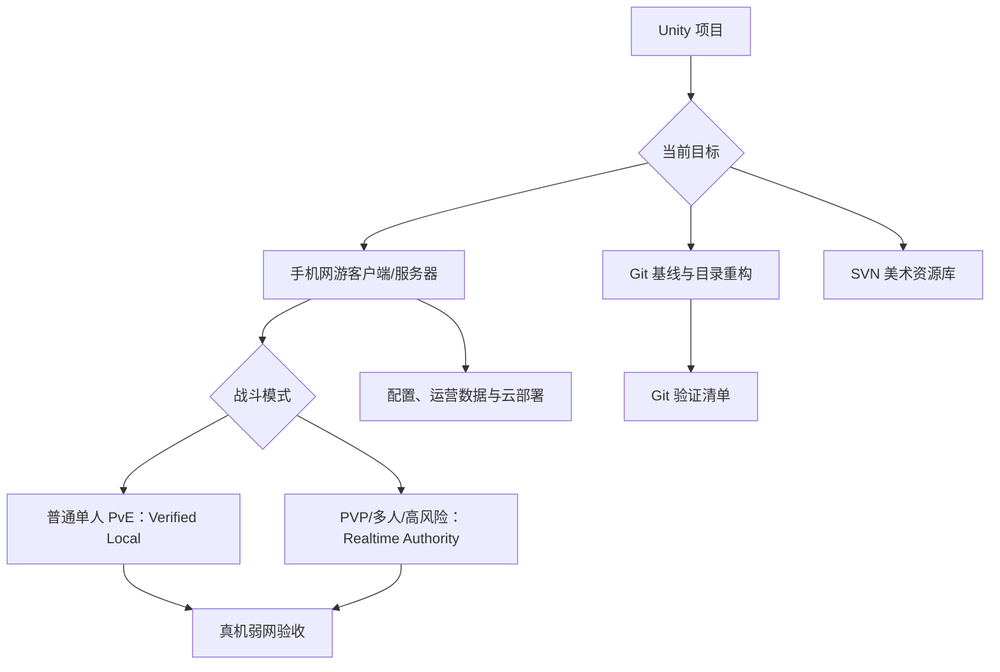

# Knowledge Index

先判断任务类型，再进入对应路线；不要把 Git、美术资源、实时战斗、单机 PvE 校验和云部署混成一次不可回滚的大改。

## 路线图

## 分类导航

| 分类 | 文件 | 用途 |
| --- | --- | --- |
| AI 总规则 | `../AGENTS.md` | 所有任务先读取的总约束 |
| Git 基线 | `new-unity-project-runbook.md` | GitHub、基线标签、目录重构 |
| 总体网游架构 | `online-game-architecture.md` | 模式选择、信任边界、实施顺序 |
| Unity 客户端 | `unity-client-networking.md` | 输入邮箱、预测/插值、恢复、Android、DIAG |
| 权威服务器 | `game-server-authority.md` | WSS、固定 Tick、租约、反作弊、账本、Outbox |
| Verified Local | `verified-local-battle.md` | 本地即时战斗、证据上传、服务器重放校验 |
| 数据与云 | `data-operations-and-cloud.md` | Excel 编译、运营事件、可迁移部署 |
| 在线游戏验收 | `../checklists/online-game-acceptance.md` | 真机、弱网、回放、结算和发布门槛 |
| SVN 美术库 | `svn-art-repository-runbook.md` | 本地 SVN 仓库、工作副本、锁定与备份 |
| 美术策略 | `art-and-lfs-policy.md` | Git、LFS、SVN 与本地资产边界 |
| 环境搭建 | `environment-setup.md` | GitHub CLI、代理、SVN 工具和路径习惯 |
| 案例复盘 | `tf2d-case-study.md` | TF_2D 已验证问题、方法和结果 |
| AI 提示词 | `../prompts/` | 可直接交给 AI 的任务入口 |

## 手机网游推荐执行顺序

1. `online-game-architecture.md`：按玩法决定权威模式。
2. `unity-client-networking.md`：建立输入、表现、生命周期和诊断边界。
3. `game-server-authority.md`：定义协议、服务器权威、终局与账本。
4. 普通单人 PvE 再读 `verified-local-battle.md`，用影子双运行迁移。
5. `data-operations-and-cloud.md`：接入配置、运营数据和可替换基础设施。
6. `../checklists/online-game-acceptance.md`：用 Release、真机和弱网完成验收。

## Git/Unity 推荐执行顺序

1. `../AGENTS.md`
2. `new-unity-project-runbook.md`
3. `../checklists/preflight.md`
4. `../templates/unity.gitignore`
5. `../templates/unity.gitattributes`
6. `../checklists/verification.md`

如果还需要本地 SVN 美术资源库，再执行 `svn-art-repository-runbook.md` 和 `../checklists/svn-art-repository.md`。
