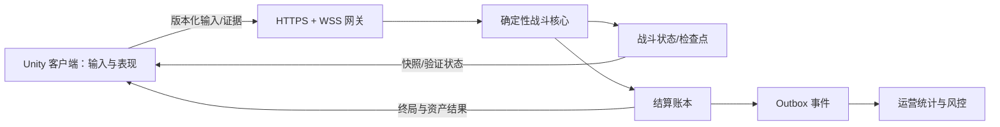

# Unity 手机网游客户端/服务器总体架构

本文给 AI 和团队一个可执行的起点。结论来自 TF_2D 在 Android 真机、Unity IL2CPP 与独立后端上的落地验证，不把尚未实施的 UDP、Kubernetes 或平台完整性服务写成既成事实。

## 经验等级

- **已验证**：在 TF_2D 真机或自动化测试中实际通过。
- **工程规则**：由已验证问题归纳出的通用约束，新项目仍需按自己的玩法验收。
- **可选演进**：只说明适用条件，不宣称已经落地。

## 先选择战斗权威模式

| 模式 | 适用场景 | 玩家操作 | 服务器职责 | TF_2D 结论 |
| --- | --- | --- | --- | --- |
| Verified Local | 普通单人 PvE、肉鸽战斗 | 本地即时模拟，无 RTT 等待 | 签发票据、重放证据、校验并原子结算 | **已验证**：显著消除高 RTT 对移动和怪物表现的影响 |
| Authoritative Realtime | PVP、多人协作、高价值或高风险玩法 | 本地预测/表现，提交输入意图 | 固定 Tick 推演、广播快照、终局与奖励权威 | **已验证架构规则**；生产部署应使用持久 WSS，不使用逐帧 HTTP |
| Pre-settled Playback | 展示型、弱交互或服务器先算完的关卡 | 播放服务器结果 | 预先生成结果与奖励 | 仅在玩法允许时使用 |

不要让一种网络模式覆盖所有玩法。普通单人 PvE 的目标是“操作不等待网络，但奖励仍由服务器校验”；竞技玩法的目标是“服务器实时权威”。

## 不可跨越的信任边界

客户端只提交意图，例如：

- `SetMoveDirection`
- `ChooseAbility`
- `RequestRevive`
- `ExitBattle`
- `Heartbeat` 与确认游标

客户端不能成为以下事实的权威来源：伤害、死亡、掉落、金币、冷却完成、结算结果或永久资产变化。即使客户端做本地计算，也只能提交可重放的输入证据；服务器从固定初态重放并得出结果。

## 共同协议必须固定的内容

每场战斗由服务器签发并固定：

- `battleId`、玩家与角色标识
- 协议版本、模拟器版本、内容版本/哈希
- 关卡、种子、开始时间、允许时长和规则集
- 单调递增的输入序号、服务器 Tick 和连接租约

协议包必须有明确版本、大小上限和未知字段策略。移动方向是“最新状态”，只保留最新待处理值；技能选择、复活、退出等离散命令使用有界队列和幂等键。不得用无界队列保存每个摇杆采样点。

## 终局、断线与结算

- 死亡、胜利、主动退出是不同终局，语义不可混用。
- 主动退出通常无奖励，但不能伪装成死亡界面。
- 应用被杀和网络断开在服务器视角可能无法区分，应保留恢复标记或进入服务器托管状态。
- 终局只能写入一次；重复请求必须返回同一结果。
- 战斗结算、资产账本、Outbox 事件在同一数据库事务中提交。
- 客户端一旦收到已证明的终局，立即展示结果；资产刷新不能阻塞结算界面。

## 已验证的关键教训

1. 约 600 ms RTT 下使用逐请求 HTTP 驱动实时战斗，会产生严重停顿、瞬移和摇杆滞留；换隧道不能修复协议模型。
2. 本地确定性模拟只有在服务端能够从 Tick 0 重放并得到完全相同哈希时才可信。
3. “有哈希链”不等于“防作弊”；服务器仍要校验票据、输入、资源上限和完整重放结果。
4. 云存档里的余额只能是 UI 镜像，永久资产必须来自不可变账本。
5. DIAG 要同时看到客户端表现、战斗核心、网络、证据、验证和结算状态，才能定位真正的首个分歧点。

## 推荐实施顺序

1. 明确玩法采用 Verified Local 还是 Authoritative Realtime。
2. 抽出客户端/服务器共享的纯确定性核心，并建立跨运行时黄金哈希测试。
3. 定义版本化协议、幂等、租约、终局和结算事务。
4. 实现 Unity 输入生命周期、表现层和 DIAG。
5. 实现服务器验证、账本、Outbox、风控信号和运营投影。
6. 执行 `checklists/online-game-acceptance.md`，真机和弱网未通过不得宣称完成。

继续阅读：`unity-client-networking.md`、`game-server-authority.md`、`verified-local-battle.md`、`data-operations-and-cloud.md`、`server-performance-concurrency.md`。
