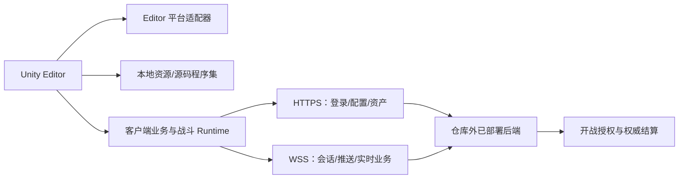

# Unity Editor 联网开发模式：只有客户端工程时运行完整产品流程

本文指导 AI 和开发团队建立一种常见的 Unity 联网开发模式：开发机只检出客户端工程，Unity Editor 在本地完成平台适配、资源读取和客户端逻辑执行，同时连接仓库外已经部署的兼容后端，完成账号、角色、业务数据、开战授权与结算。

这种模式不等于离线游戏，也不等于客户端内置服务器。它解决的是“客户端开发者无需在本机维护服务端源码和资源 CDN，仍能从启动场景走通联网产品流程”。

## 先建立正确的语义

把运行能力拆成三个彼此独立的问题：

| 能力 | 典型 Editor 实现 | 是否代表离线可玩 |
| --- | --- | --- |
| 平台与渠道能力 | Editor 模拟登录、广告、支付外壳、设备信息 | 否 |
| 资源与动态代码 | AssetDatabase、Addressables/YooAsset 模拟模式、源码程序集 | 否 |
| 游戏后端 | HTTPS/WSS 连接已部署的开发、QA 或生产后端 | 仍然联网 |
| 客户端战斗 | 本地固定 Tick、AI、技能、伤害与表现 | 不一定；开战与结算仍可能联网 |
| 完整离线后端 | 本地账号、角色、经济、任务、开战和结算 Mock | 是，但这是另一项工程 |

“本地只有客户端文件即可运行”通常只说明服务端不在本地仓库或进程内。只有断网后仍能从启动进入完整玩法并完成可信的数据闭环，才能称为完整离线模式。

## 目标架构



推荐依赖方向：

```text
UI / 玩法表现
  -> 客户端业务服务接口
     -> 真实网络适配器（Editor 与 Player 共用）
     -> Editor 平台模拟适配器（只替代渠道能力）

Battle Runtime
  -> 版本化配置 + 初始快照 + 随机种子 + 输入
  -> 不反向依赖 UI
  -> 不直接写永久资产
```

## AI 在修改项目前必须完成的审计

不要根据 `Local`、`Simulator` 或 `ClientLocalGame` 等名称推断离线能力。逐项找到代码、配置或日志证据。

### 1. 项目与启动链

1. 确认项目根目录包含 `Assets/`、`Packages/`、`ProjectSettings/`。
2. 读取 `ProjectSettings/ProjectVersion.txt` 和 `EditorBuildSettings.asset`。
3. 确认唯一受支持的 Bootstrap/Launch 场景；不要假设任意业务场景都能直开。
4. 从 `Awake`、`Start`、`RuntimeInitializeOnLoadMethod`、启动状态机追踪到主界面或首战。
5. 对每个阶段记录类、方法、文件、输入、网络依赖、失败与重试行为。

建议输出调用链：

```text
Launch Scene
-> Bootstrap
-> 平台初始化/Editor 模拟身份
-> 资源系统初始化
-> 版本或动态代码处理
-> Game Scene
-> 环境选择
-> 账号 HTTPS 登录
-> WSS 会话
-> 角色登录与模块数据
-> 主界面或 StageBegin
-> 客户端战斗
-> StageEnd/权威结算
```

### 2. 服务端依赖

搜索并追踪首个 HTTP 请求、首个 WebSocket 连接、角色数据拉取、开战和结算。检查：

- Endpoint 来自代码、Resources、StreamingAssets、ScriptableObject、环境变量还是生成配置。
- `Local` 是否仅表示 `127.0.0.1`，而不是自动启动服务端。
- 是否存在监听端口、`StartServer`、`StartHost`、子进程启动或 Loopback Transport。
- 登录失败是否真正回退到 Offline/Mock，还是只重试和弹错。
- 客户端提交的是输入/证据、战斗摘要还是可直接入账的奖励。

### 3. Editor 替代层

检查 `UNITY_EDITOR`、asmdef 平台限制、工厂注册和 Editor 菜单，确认哪些能力被替代：

- 平台 SDK 身份与 Token 外壳
- 广告、支付、埋点、客服、设备能力
- 资源清单与 AssetDatabase
- HybridCLR、ILRuntime、Lua 或其他动态代码路径
- 开发服务器选择

平台模拟登录只能产生平台层身份，不能自动等价于游戏账号认证。支付模拟只能验证 UI 和回调路径，不能给真实账号发货。

### 4. 本地状态

盘点 PlayerPrefs、EditorPrefs、JSON、SQLite、`persistentDataPath` 和缓存。明确区分：

- 开发身份、服务器别名和调试选项
- 表现设置与战斗恢复记录
- 服务端同步数据的本地镜像
- 永久资产的权威来源

本地缓存不能被描述为完整账号数据库；余额镜像不能成为永久经济权威。

## 推荐实施方案

### 阶段 1：Bootstrap 与环境模型

建立一个明确的 Launch 场景和可观察的启动状态机：

```text
PlatformInit
-> ResourceInit
-> LoadGameCode
-> SelectEnvironment
-> AccountLogin
-> ConnectRealtime
-> RoleLogin
-> LoadRoleModules
-> EnterGame
```

环境配置至少包含稳定别名、HTTPS Base URL、WSS URL、超时和可公开的内容版本。不要把密码、签名私钥、管理员 Token 或数据库凭证放进 Unity 工程。

| 别名 | 含义 |
| --- | --- |
| Local | 连接开发机回环地址；要求外部服务端已启动 |
| Development/Inner | 团队可访问的开发或内网后端 |
| QA/Staging | 验收环境 |
| Production | 正式环境；Editor 默认不应选择 |

Editor 当前选择可以存 PlayerPrefs，但配置必须有白名单与安全默认值。正式构建应固定允许的生产 Endpoint，不能携带任意环境切换菜单。

### 阶段 2：Editor 平台适配器

先定义稳定接口，再提供 Editor 实现与真机实现：

```csharp
public interface IPlatformIdentity
{
    Task<PlatformIdentityResult> SignInAsync(CancellationToken cancellationToken);
}
```

Editor 实现可以持久化一个随机开发用户 ID，并返回后端明确接受的开发凭证。不要伪造生产渠道签名，也不要在客户端保存共享生产密钥。后端必须把开发身份限制在非生产环境和测试账号范围内。

用 Editor-only asmdef 或 `#if UNITY_EDITOR` 隔离模拟实现。业务代码只依赖接口，不直接到处判断 `UNITY_EDITOR`。

### 阶段 3：Editor 本地资源模式

根据项目资源系统选择：

- 原生引用/Resources：直接从工程资源读取。
- Addressables：使用适合项目版本的 Asset Database 或模拟模式。
- YooAsset：Editor 使用 `EditorSimulateMode`，Player 使用 `HostPlayMode` 或项目明确选择的发布模式。

Editor 可以跳过远程资源版本检查和下载，但不能跳过本地内容版本计算。客户端提交给后端的协议、模拟器和内容版本必须与后端兼容。

资源失败应停在可诊断状态并允许有界重试，不能悄悄加载不兼容的默认配置。

### 阶段 4：动态代码差异

如果正式包使用 HybridCLR、ILRuntime 或脚本热更新：

- Editor 可直接使用 Unity 编译的源码程序集。
- Player 继续走 AOT Metadata、热更新 DLL 或脚本加载流程。
- 业务入口必须保持一致；只替换“代码来自哪里”，不要维护两套产品状态机。
- CI 必须分别验证 Editor 源码路径和真实 Player 动态代码路径。

### 阶段 5：真实后端连接

Editor 与 Player 应尽量共用真实的 HTTP/WSS/Protobuf 客户端，以避免模拟层掩盖协议问题。

最低链路：

1. 用平台适配器结果调用账号登录。
2. 获得短期 access token/session。
3. 建立 WSS 并完成协议握手。
4. 登录角色并拉取业务模块数据。
5. 只有所有必需模块成功后才进入完整主界面。
6. 开战前取得服务器票据或授权。
7. 战斗结束提交证据/摘要，由服务器幂等结算永久资产。

请求日志必须脱敏。证书验证不得使用“接受所有证书”的处理器；开发环境也应使用可信证书或明确隔离的本机开发证书。

### 阶段 6：客户端本地战斗

客户端可以本地执行固定 Tick、AI、移动、技能、伤害和表现，以获得即时手感；但这不自动赋予结算权威。

普通单人 PvE 优先结合 `verified-local-battle.md`：服务器签发战斗票据，客户端本地模拟并记录证据，服务器重放或严格校验后写入账本。PVP、多人和高风险玩法按 `game-server-authority.md` 采用实时权威。

## 必须设置的发布门禁

- Mock/Editor 平台实现位于 Editor-only 程序集，或保证 Player 无法引用。
- Release 禁止 `GAME_EDITOR`、调试抽屉、跳过登录、任意 Endpoint 菜单和详细请求日志。
- Release 扫描私网地址、测试账号、测试证书、Accept-All 证书代码和秘密。
- 环境配置按构建目标生成；生产包只保留获准的域名。
- 日志不包含 access token、完整账号凭证、签名、支付票据或个人敏感数据。
- 永久资产只由服务器账本改变，结算使用幂等键。
- Editor 成功不能替代 Player、CDN、动态代码、TLS、真机和弱网验收。

## 验证矩阵

| 验证 | 目的 | 必须记录 |
| --- | --- | --- |
| Editor 正常联网 | 证明完整开发链路 | 环境别名、启动状态、脱敏主机、登录/WSS/角色/开战/结算结果 |
| 后端不可达 | 证明失败语义 | 超时、重试上限、错误 UI、是否错误进入游戏 |
| 断网 | 区分本地初始化与完整离线 | 最后成功阶段、首个失败阶段、恢复网络后的行为 |
| 清洁 PlayerPrefs | 证明首次启动 | 新开发身份、默认环境、安全默认值 |
| 干净克隆 | 发现隐藏依赖 | UPM、子模块、生成物、外部 Junction、配置源 |
| Player Development Build | 覆盖真实资源/动态代码 | Bundle/CDN、DLL、TLS 和后端兼容性 |
| Release 构建检查 | 防止调试能力泄露 | Define、环境菜单、私网地址、日志、秘密扫描 |

没有执行的验证必须标记“未执行”。静态代码检查不能被写成“已经成功进入游戏”。

## 常见误判

- **`Local` 就是离线模式**：错误。它常常只是连接 `127.0.0.1`，要求外部服务端已启动。
- **客户端能计算战斗，所以不需要服务器**：错误。角色快照、开战授权、多人输入、永久奖励和结算仍可能依赖服务器。
- **Editor 不下载资源，所以项目没有 CDN 依赖**：错误。Editor 模拟路径与 Player 发布路径不同。
- **Editor 平台登录就是游戏账号登录**：错误。平台适配器只提供身份材料，账号服务仍需签发游戏会话。
- **找到 `Simulator` 就等于找到 Mock Server**：错误。必须找到协议响应、持久化与业务覆盖证据。

## A 项目静态案例证据

以下内容是一次客户端仓库静态调查得到的案例，不是所有项目都应复制的文件名或组件选择：

- Unity 2022.3 项目从 Launch 场景进入启动 FSM。
- Editor 使用平台 SDK 模拟身份。
- YooAsset 使用 `EditorSimulateMode` 从源码资源工作。
- Editor 跳过远程资源版本请求和 HybridCLR 动态 DLL 加载，直接使用已编译源码。
- 客户端包含本地战斗 Runtime、固定帧、AI、技能和伤害逻辑。
- 账号 HTTP 登录、业务 WebSocket、角色数据、`StageBegin` 和 `StageEnd` 仍连接仓库外后端。
- 当前开发环境指向内网服务器；`Local` 只配置回环地址，没有启动本地服务端。
- 未发现完整游戏后端 Mock、Host/Listen Server 或 Offline 总开关。
- 调查没有执行 Play、断网或干净机验证，因此运行结果不能由静态证据替代。

可复用结论是架构边界，而不是案例中的私有地址、目录或类名：Editor 替代平台和发布基础设施，真实业务协议仍连接兼容后端，客户端战斗与服务器结算保持明确的信任边界。

## 可直接交给项目 AI 的任务入口

```text
请先完整阅读 AGENTS.md、docs/unity-editor-connected-development.md、docs/online-game-architecture.md 和 docs/unity-client-networking.md。

目标：让当前 Unity 客户端工程在没有本地服务端源码和本地 CDN 的情况下，从受支持的 Launch 场景在 Unity Editor 中连接已部署的 Development/QA 后端，走通平台身份、资源初始化、账号登录、WSS、角色数据、主界面、开战和权威结算。不要把目标误解为完整离线模式。

先只读审计并输出证据：Unity 版本、启动场景、完整启动调用链、平台 SDK 分支、资源模式、动态代码模式、环境配置、首个 HTTP/WSS、角色数据、开战和结算、PlayerPrefs/本地记录、条件编译、asmdef、隐藏依赖和发布风险。每个结论附真实文件路径与代码位置，区分代码事实、配置事实、日志、实际测试和推断。

然后按阶段实施：
1. 建立唯一 Bootstrap 和可诊断启动状态机；
2. 抽象平台身份并提供 Editor-only 模拟适配器；
3. 建立 Development/QA/Production 环境模型和安全默认值；
4. 配置 Addressables/YooAsset/现有资源系统的 Editor 本地模式；
5. Editor 跳过发布专用下载或动态 DLL 加载，但保持同一业务入口；
6. 复用真实 HTTP/WSS/协议客户端完成账号、角色和业务链；
7. 保持 StageBegin/StageEnd 与永久资产的服务器权威；
8. 增加 Release 门禁、脱敏日志与自动检查。

每阶段执行最小相关测试并报告真实结果。不要写入秘密，不要关闭证书校验，不要让 Mock 或任意环境切换能力进入 Release。若缺少后端地址、开发认证契约或资源系统信息，报告准确阻塞点，不要虚构接口。
```

## 与本知识库其他文档的关系

- 玩法权威选择：`online-game-architecture.md`
- Unity 输入、恢复、WSS 与 DIAG：`unity-client-networking.md`
- 战斗协议、结算、账本与反作弊：`game-server-authority.md`
- 单人 PvE 本地即时模拟与服务器重放：`verified-local-battle.md`
- 后端部署和 TLS/WSS：`cloud-game-server-deployment-runbook.md`
- 真机、弱网和发布验收：`../checklists/online-game-acceptance.md`
