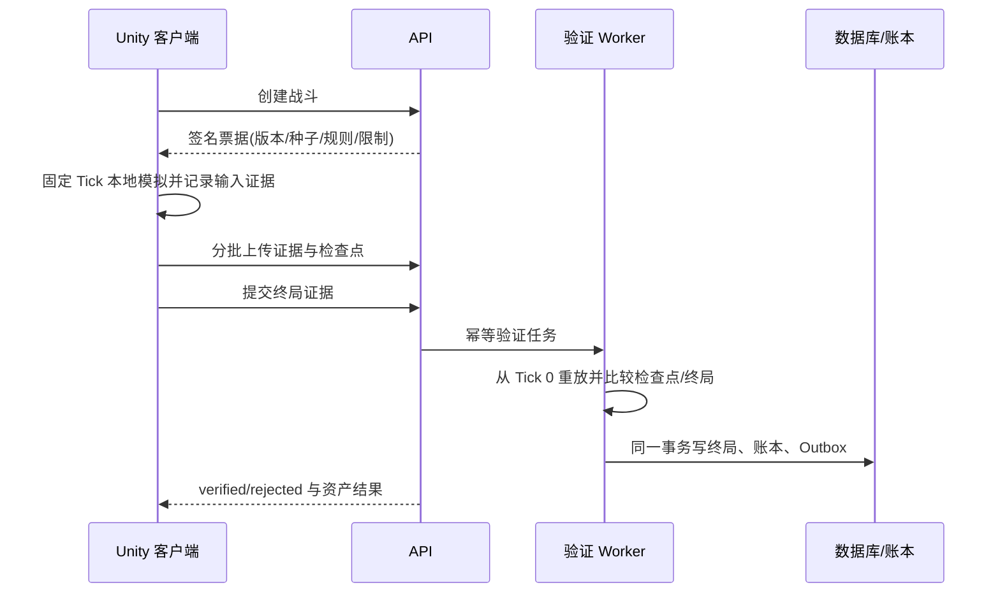

# Verified Local：客户端即时战斗、服务器重放校验

Verified Local 适合普通单人 PvE：客户端本地计算战斗以获得即时手感，服务器通过确定性重放决定永久奖励。它不是“信任客户端结算”，也不是断网时无条件发奖。

## 完整流程

## 战斗票据

服务器签发的票据至少固定：协议版本、模拟器版本、内容哈希、战斗 ID、账号/角色、关卡、随机种子、开始/过期时间、最大 Tick、允许操作和风险策略。票据签名密钥只在服务器端。

客户端启动战斗前必须确认本地内容哈希与票据一致；不一致时更新或拒绝进入，不能悄悄使用默认配置。

## 证据而非结果

记录会影响确定性模拟的离散变化：

- 量化后的移动方向变化
- 技能或升级选择
- 复活请求
- 主动退出
- 必要的生命周期事件

每条记录包含 Tick 和单调序号。连续相同方向无需每 Tick 重复。按有界批次上传，例如每批最多 256 条/64 KiB；具体阈值由压测决定，而不是复制示例数字。

## 检查点与哈希

每隔固定 Tick 对规范化状态做 SHA-256 检查点，最终状态再做一次。规范化状态必须固定字段顺序、集合排序、数值格式和版本。哈希链用于快速定位首个分歧，但不能单独证明客户端没有作弊；真正的权威是服务器从票据初态完整重放。

## 状态机

`collecting -> pending -> verifying -> verified | rejected`

- 上传和提交都支持断点续传与幂等重试。
- `pending/verifying` 时客户端显示“等待验证”，不提前写永久资产。
- `verified` 后原子写入终局与账本。
- `rejected` 返回稳定错误码、首个分歧 Tick 和可公开的诊断信息。
- 应用被杀后根据本地游标继续上传/查询；不要另开一场冒充恢复。

## 双运行迁移法

1. 从现有战斗抽出共享的纯确定性核心。
2. 建立跨客户端/服务器的黄金场景与精确哈希测试。
3. 先影子双运行：旧逻辑仍决定结果，新核心只记录分歧。
4. 分歧为零并完成真机矩阵后，启用证据上传与服务器重放。
5. 最后才把永久结算切到 Verified Local。

直接一次性改写战斗与结算会让网络、玩法和存档错误混在一起，难以确定根因。

## TF_2D 已验证结果

- 原实时 HTTP 方案在高 RTT 下产生角色/怪物明显卡顿和瞬移。
- Verified Local 后，摇杆、怪物、技能和倒计时由本地固定 Tick 推进，不再等待每次网络往返。
- 首次回放拒绝通过 DIAG 定位到 Tick 20 的方向表传输差异；修正协议后，华为 Android 10 真机完成验证并正确结算 50 金币。
- 服务端 Release + 稀疏检查点优化将 2607 Tick 核心回放从约 10.47 秒降至约 1.83 秒，哈希结果保持一致。

这些数字是案例证据，不是所有项目的性能承诺。新项目仍须执行自己的设备、内容和并发基准。
